# Générer une notification de déploiement avec Azure Functions

## 1) Quelques mots sur Azure Functions
Azure Functions est une technologie dite "event-driven" et "serverless".
Les fonctions Azure permet d'exécuter du code dans le cloud uniquement lorsque cela est nécessaire.
Nous serons donc facturés seulement à l’utilisation, c’est-à-dire lorsqu’il y aura un traitement effectif.
Dans ce mini-hack, il s'agit de mettre en place un service capable d'envoyer un mail de notification lorsque le déploiement de l'application est terminée.
Pour ce faire, nous allons utiliser conjointement Azure Functions et SendGrid.
La création de fonctions Azure est possible depuis [un portail dédié à Azure Functions] (https://functions.azure.com/signin) ou depuis le portail Azure.
Dans ce mini hack, nous utiliserons le portail Azure Functions. 

## 2) Créer un compte SendGrid et une clé d'API

Sendgrid est un service qui permet d’envoyer des emails via des API. 
Des SDK pour de nombreux langages comme C#, Ruby, NodeJS et PHP facilitent l'utilisation des API de SendGrid.
Sengrid est disponible depuis le Marketplace Azure et permet l'envoi de 25000 emails gratuits chaque mois.
Nous allons maintenant créer un compte SendGrid et une clé d'API pour pouvoir envoyer des emails depuis notre fonction Azure :
- Connectez-vous au portail Azure
- Cliquez sur __Nouveau__
- Dans la zone de recherche __Rechercher dans le marketplace__, saisissez __SendGrid__
- Tapez sur le touche __Entrée__ de votre clavier pour lancer la recherche


*Le Marketplace Azure trouve "SendGrid Email Delivery" dans les résultats de la recherche.*


- Cliquez sur __SendGrid Email Delivery__ dans les résultats de la recherche
- Dans la section __SendGrid Email Delivery__, cliquez sur __Créer__


- Renseignez les informations nécessaires pour la création du compte SendGrid :
    - Dans la zone de saisie __Name__, saisissez un nom de compte
    - Dans la zone de saisie __Password, saisissez un mot de passe
    - Dans la zone de saisie __Confirm Password, confirmez le mot de passe
    - Dans la zone de sélection __Abonnement__, sélectionnez l'abonnement Azure (dans le cas où vous possédez plusieurs comptes Azure)
    - Dans la zone __Groupe de ressources__, créez un nouveau groupe de ressources ou sélectionnez un groupe de ressources existant
    - Cliquez sur __Princing tiers__ puis sélectionnez l'offre __F1 Free__ et cliquez sur __Sélectionner__ pour valider le pricing
    
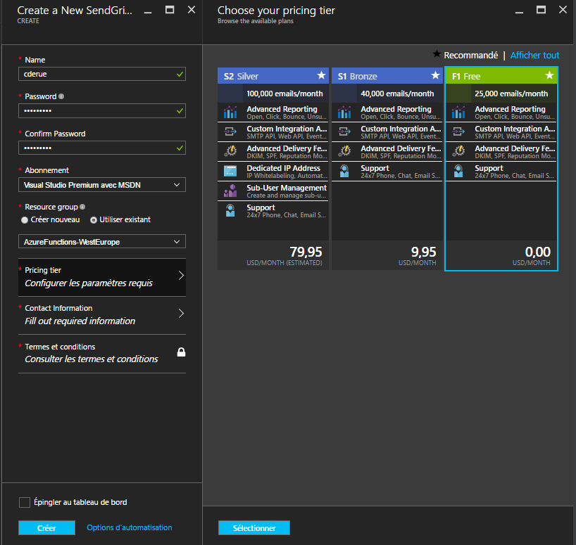

    - Cliquez sur __Contact Information__ et remplissez le formulaire de contact 
    
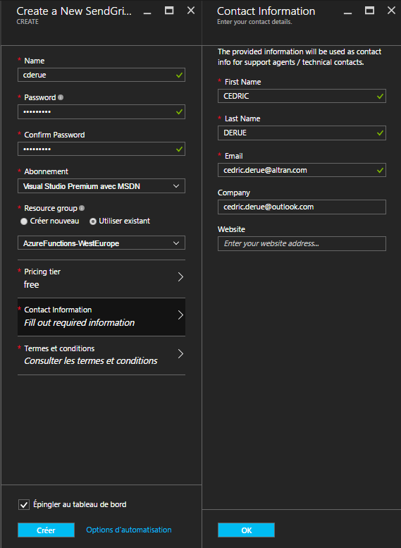

    - Cliquez sur __Termes et conditions__  et cliquez sur __Acheter__

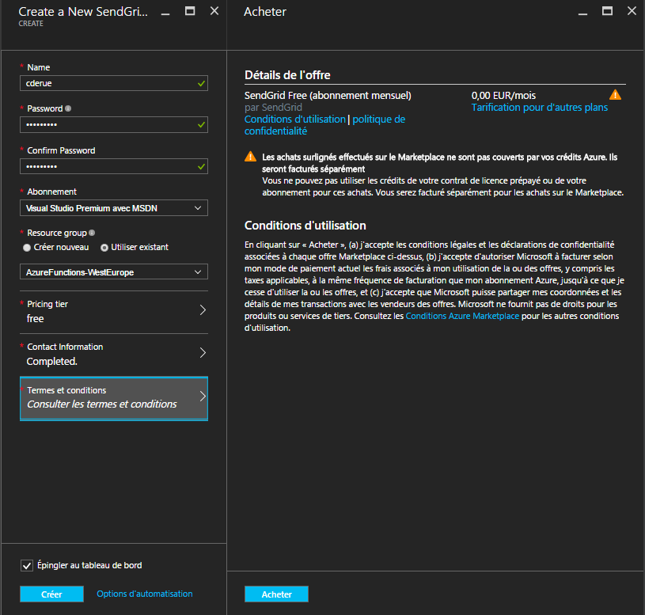

    - Cochez la case __Epingler au tableau de bord__
    - Cliquez sur __Créer__ pour lancer la création du compte SendGrid
    
*Après quelques instants, le compte SendGrid est prêt et les informations générales du compte s'affiche dans le portail Azure.*


Nous allons maintenant nous connecter au portail SendGrid pour créer une clé d'API que nous utiliserons par la suite avec Azure Functions pour envoyer des emails.
- Cliquez sur __Manage__


*Le portail Azure nous redirige vers le portail SendGrid.*

- Dans le panneau gauche du portail SenGrid, cliquez sur __Settings > API Keys__
- En haut à droite du portail, cliquez sur __Create API Key__ puis sur __General API Key__

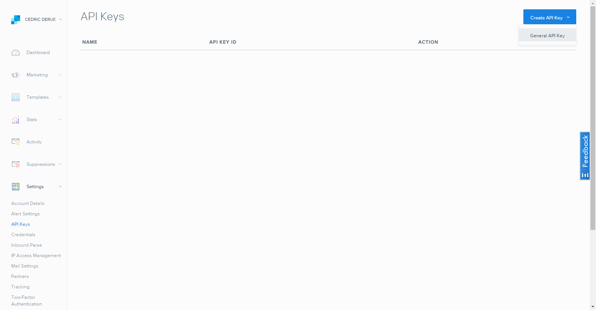

- Dans le formulaire de création d'une nouvelle API :
    - Saisissez un nom pour la nouvelle clé
    - Paramétrez les droits en sélectionnant __FULL ACCESS__ pour les sections __Mail Send__ et __Template Engine__
    - Cliquez sur __Save__ pour sauvegarder la nouvelle clé d'API
    
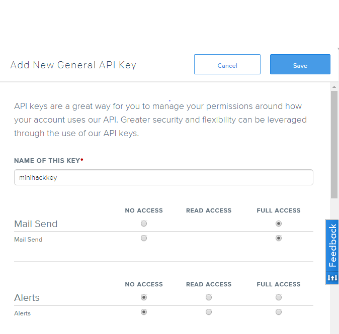

*SendGrid crée alors une nouvelle clé d'API et affiche la valeur de la clé.*

- Copiez la valeur de la clé d'API et collez-là dans un fichier texte

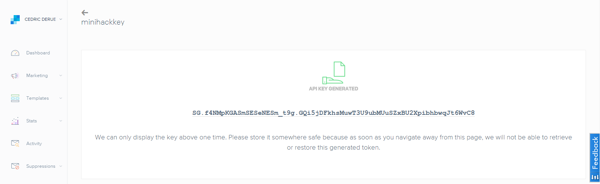

## 3) Créer un service d'envoi d'email avec Azure Functions

Pour initialiser un nouveau service avec Azure Functions :

- Connectez-vous à l'adresse au portail Azure Functions à l'adresse https://functions.azure.com/signin
- Dans la zone de saisie __Name, indiquez le nom la nouvelle fonction ou laissez le nom proposé par défaut
- Dans la zone de sélection __Region__, choisissez la localisation __West Europe__
- Cliquez sur __Create + get started__

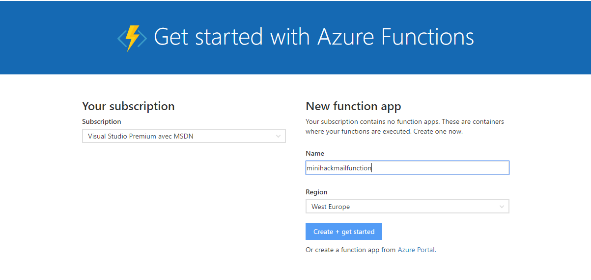

*L'initialisation de la nouvelle fonction prend quelques secondes.*
*Puis, une redirection vers le portail Azure se produit afin de demander à l'utilisateur les infos complémentaires pour terminer la création de la fonction.*

- Renseignez les informations nécessaires pour déterminer le type de fonction et le langage à utiliser :  
    - Cliquez sur __WebHook + API__
    - Sélectionnez __JavaScript__ comme langage de la nouvelle fonction
    - Cliquez sur __Créer cette fonction__

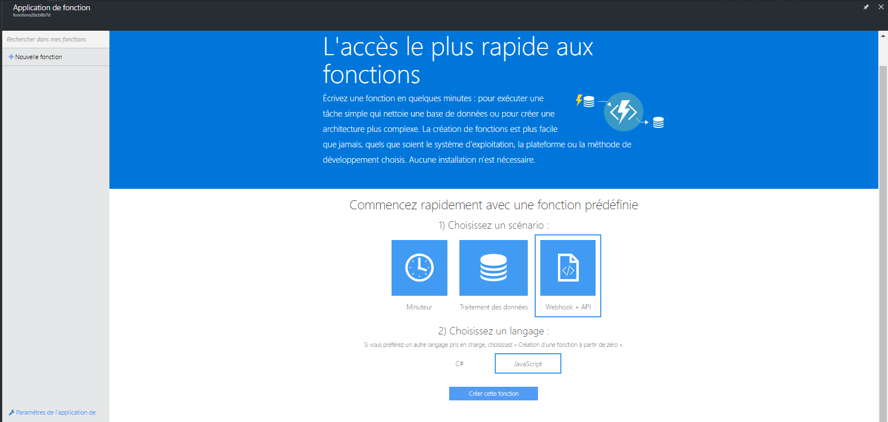

*Azure Functions génére une fonction Node.js prédéfinie.*

L'écran de visualisation de la fonction comporte les zones suivantes :
- URL de la fonction : cette URL sera utilisée plus tard dans la création d'un web hook dans la console Kudu
- Code : implémentation du code de la fonction Azure
- Journaux : console d'affichage des traces d'exécution de la fonction lorsque que celle-ci est appelée
- Exécuter : interface de test de la fonction


- Effacez le code généré par défaut et remplacez-le par le code ci-dessous : 

```javascript
module.exports = function(context, req) {
    var apiKey = "<Insérer la clé d'API SendGrid>";
    var mailFrom = "noreply@azurefunctions.com";
    var mailTo = "<Insérer votre email>";
    var helper = require('sendgrid').mail;
    var from_email = new helper.Email(mailTo);
    var to_email = new helper.Email(mailTo);
    var subject = "Azure deployment";
    var message = body.status;
    var content = new helper.Content('text/plain', message);
    var mail = new helper.Mail(from_email, subject, to_email, content);

    var sg = require('sendgrid')(apiKey);
      var request = sg.emptyRequest({
        method: 'POST',
        path: '/v3/mail/send',
        body: mail.toJSON(),
    });

  sg.API(request, function(error, response) {
    console.log(response.statusCode);
    console.log(response.body);
    console.log(response.headers);
  });
     
    context.done();
};
```

## 4) Installer le package NPM pour SendGrid 

Pour que le code de notre fonction Azure puisse s'exécuter correctement, il faut installer le package NPM SendGrid.

Connectez-vous à l'adresse https://minihackmailfunction.scm.azurewebsites.net/DebugConsole

*Le navigateur affiche la console Kudu.*

- Dans la console affichée dans la page, exécutez la commande suivante pour naviguer jusqu'à la racine de l'application Azure Functions :

```bash
$ cd home\site\wwwroot
```

- Dans la zone d'arborescence des fichiers, cliquez sur le bouton [+] pour créer un nouveau fichier
- Nommez ce fichier __package.json__
- Cliquez sur l'icône "Crayon" du fichier __package.json__

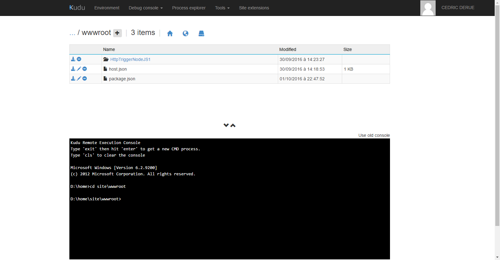

- Ajoutez l'extrait de code ci-dessous au fichier __package.json__

```json
{
  "name": "azure-functions",
  "version": "1.0.0",
  "private": true,
  "dependencies": {
   "sendgrid": "^4.3.1"
  }
}
```
- Cliquez sur __Save__ pour sauvegarder les modifications 

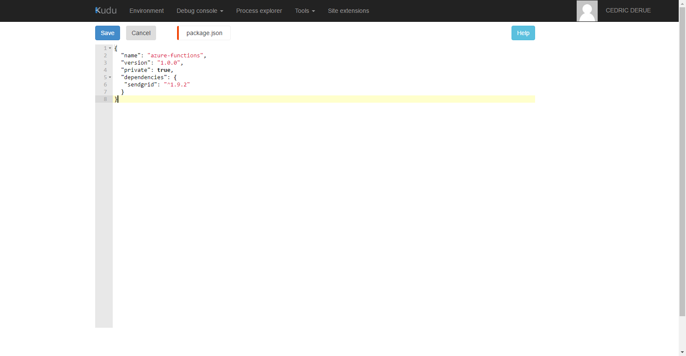

- Exécutez la commande suivante depuis la console Kudu (vérifiez que vous êtes bien dans le répertoire __home\site\wwwroot__) :

```bash
$ npm install
```

*Un dossier "node_modules" est créé dans le dossier courant avec le package "sendgrid" à l’intérieur.*
*Ce package sera utilisé depuis le code de notre fonction Azure.*

## 5) Créer un web hook vers le service d'envoi d'email

Pour appeler notre fonction Azure après chaque déploiement de l'application Symfony sur Azure, il est nécessaire de créer un Web Hook.
Pour faire nous allons nous connecter à la console Kudu de l'application web Azure créée dans ce mini-hack :
- Connectez-vous à l'adresse https://minihacksymfony.scm.azurewebsites.net/DebugConsole
- Dans le menu principal, cliquez sur __Tools > Web hooks__
- Dans le champ de saisie __Subscriber URL__, copiez-collez l'URL de la fonction Azure d'envoi d'emails
- Sélectionnez __Post Deployment__
- Cliquez sur __Add URL__ pour valider l'ajout du web hook

*Une nouvelle URL apparaît maintenant dans la liste des web hooks.*

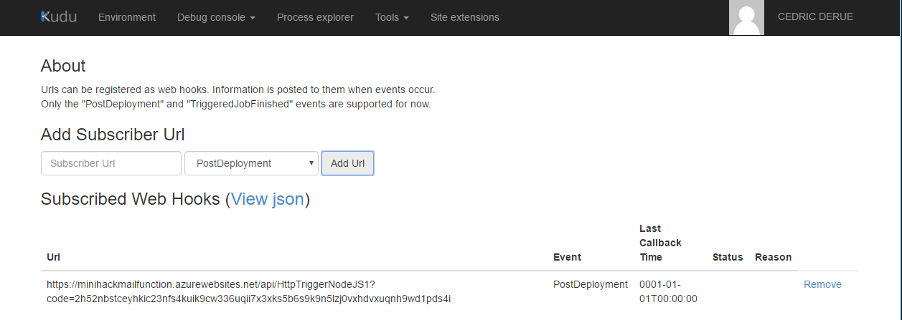

## 6) Modifier le code source de l'application Symfony

Testons maintenant si notre fonction Azure d'envoi d'emails fonctionne correctement.

Pour cela nous allons modifier le code source de l'application Symfony créée dans ce mini-hack :
- Editez le fichier le fichier __app/Resources/views/default/index.html.twig__
- Modifiez le code source de la balise __div__ avec l'id "welcome" comme ci-dessous :

```html
<div id="welcome">
    <h1><span>Welcome to</span> Symfony on <span style="color:#00BCF2">Azure</span> {{ constant('Symfony\\Component\\HttpKernel\\Kernel::VERSION') }}</h1>
</div>
```

*Cette modification du code va donc changer le titre "Welcome to Symfony" en "Welcome to Symfony on Azure" une fois l'application publiée sur Azure.**

- Exécutez les commandes suivantes depuis un terminal :

```bash
$ git add app/Resources/views/default/index.html.twig
$ git commit -m "Modification du titre" 
$ git push azure master
```

Le déploiement prend quelques secondes. Une fois celui-ci terminé, nous devons observer le résultat suivant :

- La réception d'un email indiquant la fin du déploiement de l'application


- L'affichage du titre "Welcome to Symfony on Azure" après rafraichissement de l'application web Azure dans le navigateur

