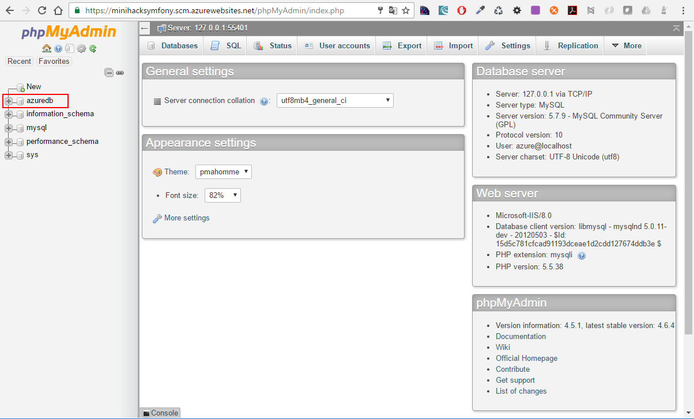

# Ajouter une base de données MySQL à une application Symfony sur Azure App Service MySQL in-app

## 1) Quelques mots sur MySQL In App

MySQL in-app est une nouvelle fonctionnalité (en preview pour l'instant) conçue pour permettre l'exécution d'une base de données MySQL sur une instance Azure App Service.
Cette fonctionnalité permet au développeur qui a besoin d'une base de données MySQL clé en main de gagner du temps.
MySQL in-app n'est pas prévu pour être utilisé en production.

## 2) Activer MySQL In App

Pour activer la fonctionnalité MySQL In App au niveau d'une application web Azure :
- Rendez-vous sur le [portail Azure](http://portal.azure.com)
- Sélectionnez une application web Symfony sur Azure
- Cliquez sur __MySQL in-app(Preview)__
- Activez __MySQL In App__
- Désactivez le journal des requêtes lentes MySQL (désactivé par défaut)
- Désactivez le journal général MySQL (désactivé par défaut)
- Cliquez sur __Enregistrer__ pour enregistrer les paramètres MySQL In App

## 3) Ouvrir phpMyAdmin

- Cliquez sur __Gérer__ pour ouvrir phpMyAdmin commme le montre la figure ci-dessous :


Dans le formulaire de connexion à phpMyAdmin :
- Saisissez __azure__ comme identifiant utilisateur
- Saisissez __password__ comme mot de passe
- Cliquez sur __Login__


La base de données créée par Azure se nomme __azuredb__ commme le montre la figure ci-dessous :



## 4) Configurer la connexion à MySQL dans une application Symfony

- Editez le fichier __parameters.yml__ pour configurer la connexion à MySQL dans une application Symfony :

```bash
# app/config/parameters.yml
parameters:
    database_host:      127.0.0.1
    database_name:      azuredb
    database_user:      azure
    database_password:  password

# ... 
```