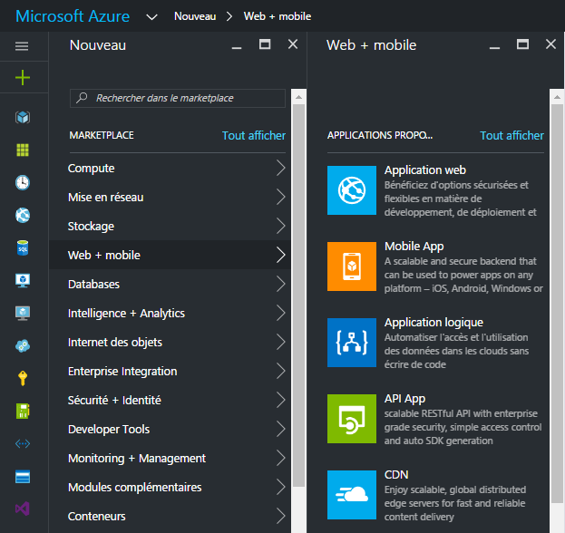
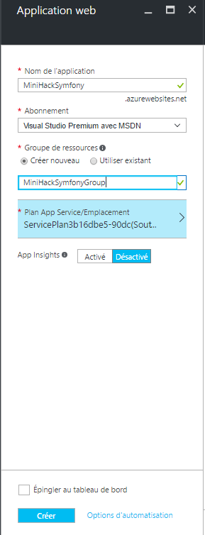
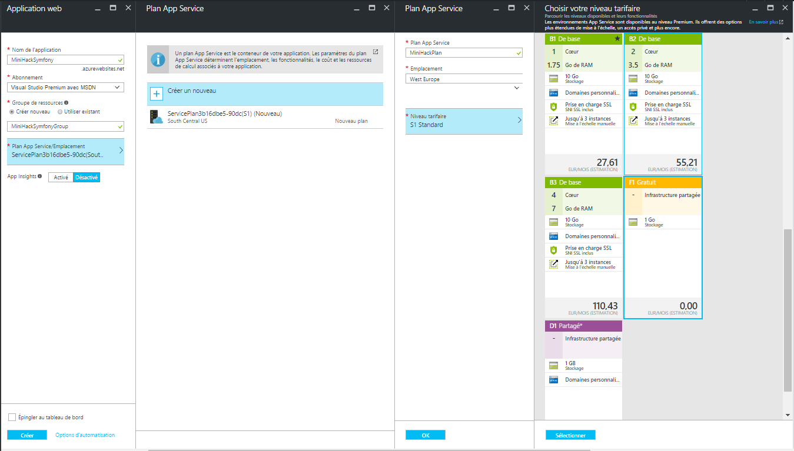
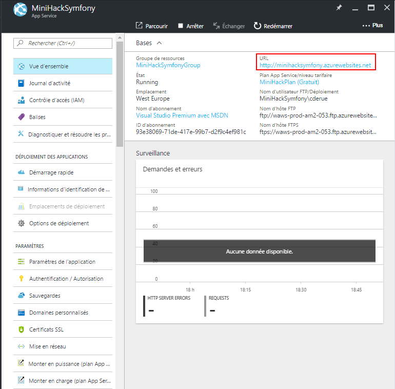
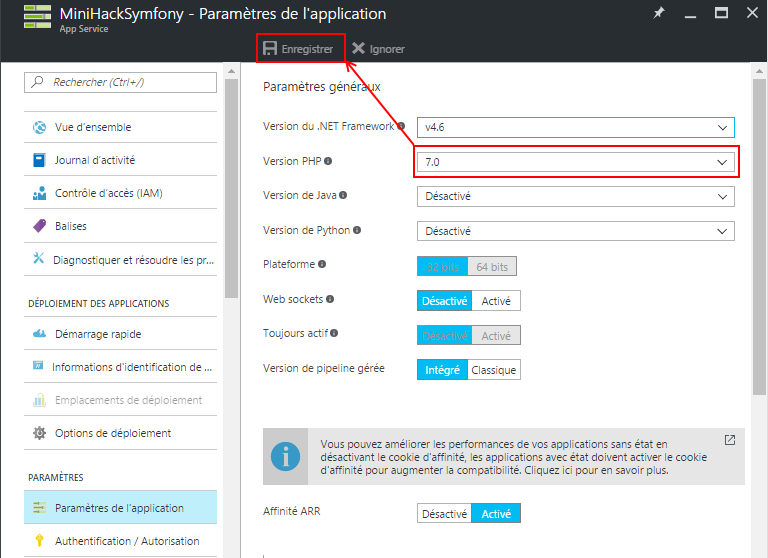
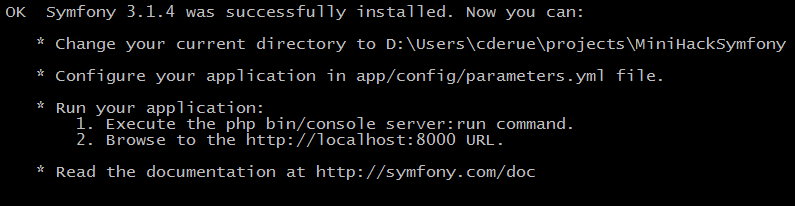
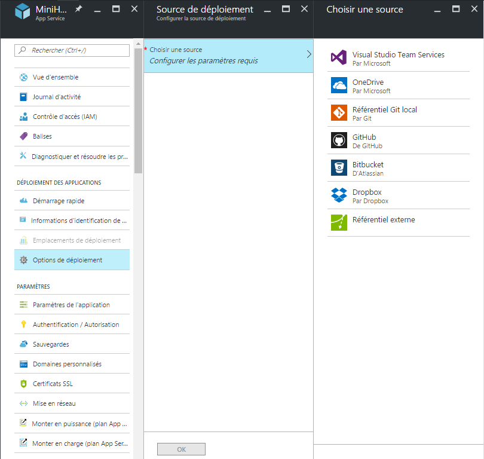
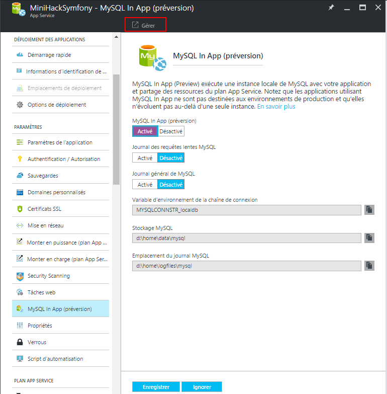

# Microsoft Azure App Service
Pour ce mini-hack, je vous propose d'utiliser Microsoft Azure App Service pour déployer une application PHP Symfony3.
Ce tutoriel se déroule en 5 phases :

1. La vérification des prérequis nécessaires
2. La création d'une application web Azure avec [Microsoft Azure App Service](https://azure.microsoft.com/fr-fr/services/app-service/)
3. La création et le déploiement d'une application [Symfony3](https://symfony.com/) sur Microsoft Azure
4. L'ajout d'une base de données MySQL à une application web Azure avec [Azure App Service MySQL in-app](https://blogs.msdn.microsoft.com/appserviceteam/2016/08/18/announcing-mysql-in-app-preview-for-web-apps/)
5. Le paramétrage d'une notification de déploiement avec [Microsoft Azure Functions](https://azure.microsoft.com/fr-fr/services/functions/)

## 1) Prérequis
- L'un des éditeurs de code avancé suivant : 
    - [Visual Studio Code](https://code.visualstudio.com)
    - [Atom](https://atom.io/)
    - [Sublime Text](https://www.sublimetext.com/)
- Un compte Microsoft Azure :
    - [Microsoft Azure](https://azure.microsoft.com/fr-fr/free/)
- Git :
    - [Git pour Windows](https://git-scm.com/download/win)
    - [Git pour Mac OS X ou Linux](https://git-scm.com/book/fr/v1/D%C3%A9marrage-rapide-Installation-de-Git)
- Une distribution récente de PHP 5 ou 7 :
    - [PHP 5.6](https://secure.php.net/downloads.php#v5.6.26)
    - [PHP 7.0](https://secure.php.net/downloads.php#v7.0.11)

## 2) Création d'une nouvelle application web avec Azure App Service

### 2.1) Quelques mots sur Azure App Service

Azure App Service est un service de plateforme ou Paas (Platform as a Service) qui permet de créer des applications web et mobiles dans le cloud Azure.

### 2.2) Créer une nouvelle application web avec Azure App Service

Pour créer une nouvelle application web depuis le [portail Azure](https://portal.azure.com) :

- Cliquez sur Nouveau > Web + mobile > Application web



- Complétez ensuite les premières informations nécessaires :
    - Nom de l'application : à vous de choisir
    - Abonnement Azure (dans le cas où vous auriez plusieurs abonnements Azure)
    - Groupe de ressources : un nouveau groupe de ressource pour le mini-hack sera parfait
        
       

- Créez un [plan Azure App Service](https://azure.microsoft.com/fr-fr/documentation/articles/azure-web-sites-web-hosting-plans-in-depth-overview/) pour l'application web :
    - Cliquez sur [+] Créer nouveau
    - Saisissez le nom du plan App Service
    - Sélectionnez un emplacement : pour ce mini-hack, sélectionnez l'Europe occidentale (West Europe)
    - Cliquez sur Niveau de tarification puis cliquez sur Afficher tout pour afficher davantage d'options de tarification, telles que Gratuit et Partagé
    - Sélectionnez le niveau de tarification F1 (gratuit) pour le service  puis cliquez sur Sélectionner
    - Valider l'ensemble en cliquant sur OK

        
 
- Renseignez enfin les dernières informations nécessaires :
    - App Insights : laisser désactivé cette fonctionnalité qui n'est pas dans le périmètre de ce mini-hack
    - Epingler au tableau de bord : conseillé pour accéder plus facilement à votre service
    - Cliquez sur le bouton Créer pour lancer la création de l'appplication web
     


*Une fois la création terminée, le portail Azure affiche une vue d'ensemble de l'application web.*

- Cliquez sur le lien vers l'URL de l'application web



*Le navigateur affiche une page par défault indiquant que l'application web a été créée avec succès.*


### 2.3) Configurer la version de PHP

Azure App Service permet de paramétrer la version de PHP utilisée pour l'exécution d'une application PHP.
Nous allons maintenant paramétrer l'application web Azure pour qu'elle utilise la PHP en version 7.

- Dans la section Paramètres, cliquez sur Paramètres de l'application
- Sélectionnez la version 7 de PHP
- Cliquez sur Enregistrer pour valider les modifications

   

## 3) Création et déploiement d'une application PHP Symfony3

### 3.1) Quelques mots sur Symfony3

Symfony3 est la dernière version du framework Symfony de SensioLabs. 
Ce framework permet de créer des applications PHP allant du simple blog aux grandes applications critiques d'entreprise.
Symfony permet de programmer avec une approche orientée composant en permettant ainsi au développeur d'utiliser toute ou partie du framework dans la construction d'une application.

### 3.2) Créer une nouvelle application Symfony3

#### 3.2.1) Installer Symfony Installer

Pour ce faire, nous allons utiliser un programme d'installation dédié nommé __Symfony Installer__.

- Pour installer __Symfony Installer__, suivez les instructions ci-dessous en fonction de votre système d'exploitation :

```bash
# Sous Mac OS X ou Linux
$ sudo curl -LsS https://symfony.com/installer -o /usr/local/bin/symfony
$ sudo chmod a+x /usr/local/bin/symfony

# Sous Windows
c:\> php -r "file_put_contents('symfony', file_get_contents('https://symfony.com/installer'));"
```

Note pour les utilsateurs sous Windows :
- Ajoutez le fichier __symfony__ dans la variable d'environnement __PATH__ pour pouvoir appeler ce programme depuis n'importe quel répertoire.

#### 3.2.2) Démarrer un nouveau projet d'application Symfony

- Pour démarer un nouveau projet d'application Symfony, suivez les instructions ci-dessous en fonction de votre système d'exploitation :

```bash
# Sous Mac OS X ou Linux
$ symfony new <my_project_name>

# Sous Windows
$ php symfony new <my_project_name>
```

*Après quelques secondes, la nouvelle application Symfony est prête pour être exécutée en local comme le montre la figure suivante :*



Pour ce faire, suivez les instructions indiquées dans le terminal comme le montre la figure ci-dessous (ignorez la configuration du fichier parameters.yml) :

*Le navigateur affiche alors la page montrée dans la figure ci-dessous :*


### 3.3) Configurer le déploiement d'une application web sur Azure

Pour déployer une application web sur Azure, il faut au préalable retourner sur l'application web Azure créée dans le paragraphe 2.2. 
pour configurer la souce de déploiement :
- Rendez-vous sur le [portail Azure](http://portal.azure.com)
- Cliquez sur l'application web (épinglée normalement sur le tableau de bord du portail)
- Dans la section Déploiement des applications, cliquez sur Options de déploiement
- Cliquez sur Choisir la source
- Sélectionnez Référentiel Git local
- Cliquez sur OK pour valider le choix de la source de déploiement
    


*L'application web dispose désormais d'une URL de clonage Git accessible depuis la vue d'ensemble de l'application comme le montre la figure suivante :*


Si vous n'avez jamais déployé d'application web Azure à partir d'un référentiel Git local, il est nécessaire de renseigner les informations d'identification du référentiel Git local :
    - Dans la section Déploiement des applications, cliquez sur Informations d'identification de déploiement
    - Saisissez un nom d'utilisateur
    - Saisissez un mot de passe
    - Confirmez le mot de passe
    - Cliquez sur Enregister pour valider les informations d'identification
        


### 3.4) Déployer une application Symfony sur Azure

Maintenant que la source de déploiement est entièrement configurée, il est temps de déployer l'application PHP Symfony3 créée dans le paragraphe 3.2.
Juste avant cela, intéressons nous aux 3 fichiers contenus dans le répertoire __Sources__ du mini-hack :
- __web.config__
- __.deployment__
- __deploy.sh__

*Le fichier web .config :*
Ce fichier permet de définir les règles de réécriture des URL comme vous le feriez habituellement dans un fichier .htaccess. 
Ces règles sont nécessaires pour que l'application se comporte correctement lors de la navigation.

*Le fichier .deploiement :*
Ce fichier permet de personnaliser le déploiement d'une application web sur Azure avec Azure App Service.
Dans cet exemple, le fichier __.deployment__ contient une instruction de configuration pour que le fichier __deploy.sh__ soit exécuté lors du déploiement.

*Le fichier deploy.sh :*
Ce fichier écrit en shell permet de scripter le déploiement de l'application. Le nom du fichier est important pour que le déploiement fonctionne (n'oubliez paz le point devant le nom).
Son utilisation n'est pas systématique lorsque l'on déploie des application web avec Azure App Service.
Néanmoins, pour une application qui utilise le programme composer pour installer les dépendances du projet d'application, le fichier .deployment est obligatoire.
Le fichier .deployment 

Pour procéder au déploiement de l'application :
- Copiez les fichiers __web.config__, __.deployment__ et __deploy.sh__ à la racine du projet d'application Symfony
- Exécutez les commande suivantes depuis un terminal :

```bash
$ git init
$ git remote add azure <url_de_clonage_git_de>
$ git add .
$ git commit -m "Déploiement de l'application PHP Symfony3" 
$ git push azure master
```

*Le déploiement dure quelques minutes.*
*Une fois le déploiement terminé, lancez de nouveau l'application web Azure dans un navigateur pour observer le résultat.*


## 3) Ajouter une base de données MySQL dans une application web avec Azure App Service MySQL in-app

### 3.1) Quelques mots sur MySQL In App

MySQL in-app est une nouvelle fonctionnalité (en preview pour l'instant) conçue por permettre l'exécution d'une base de données MySQL sur une instance Azure App Service.
Cette fonctionnalité permet au développeur qui a besoin d'une base de données clé en main de gagner du temps.
MySQL in-app n'est pas prévu pour être utilisé en production.

### 3.2) Activer MySQL In App

Pour activer la fonctionnalité MySQL In App au niveau d'une application web Azure :
- Rendez-vous sur le [portail Azure](http://portal.azure.com)
- Cliquez sur l'application web (épinglée normalement sur le tableau de bord du portail)
- Cliquez sur MySQL in-app(Preview)
- Activez MySQL In App
- Désactivez le journal des requêtes lentes MySQL (désactivé par défaut)
- Désactivez le journal général MySQL (désactivé par défaut)
- Cliquez sur Enregistrer pour enregistrer les paramètres MySQL In App

### 3.2) Obtenir l'identifiant utilisateur et le mot de passe MySQL In App

Le répertoire Sources de ce min-hack contient un fichier nommé __get_mysql_connection.php__ et qui permet de récupérer l'identifiant utilisateur et le mot de passe.

- Copiez le fichier __get_mysql_connection.php__ à la racine du projet d'application Symfony3
- Déployer l'application en exécutant les commandes suivantes depuis un terminal :

```bash
$ git add get_mysql_connection.php
$ git commit -m "Déploiement du fichier get_mysql_connection.php" 
$ git push azure master
```

- Une fois le déploiement terminé, accédez à l'URL du fichier depuis un navigateur pour afficher l'identifiant utilisateur et le mot de passe.


### 3.4) Ouvrir phpMyAdmin

- Cliquez sur Gérer pour ouvrir phpMyAdmin commme le montre la figure ci-dessous :



Le navigateur affiche la page de connexion à phpMyAdmin et demande à  commme le montre la figure ci-dessous :
A cet instant précis, nous ne connaissons pas l'identifiant utilisateur et le mot de passe générés par Azure pour se connecter à 


- Dans la page de connexion de phpMyAdmin, saisissez le nom d'utilisateur et le mot de passe


La base de données créée par Azure se nomme __azuredb__ commme le montre la figure ci-dessous :


### Configurer la connexion à MySQL dans une application Symfony

```bash
# app/config/parameters.yml
parameters:
    database_host:      <>
    database_name:      azuredb
    database_user:      root
    database_password:  password

# ... 
```

Modifiez le fichier __get_mysql_connection.php__ avec  la racine du projet d'application Symfony3 et déployer de nouveau l'application.
Une fois le déploiement terminé, vous pouvez commencer à utiliser la fonctionnalité de gestion des tâches de l'application. 
Les tâches créées sont désormais stockées dans la base de données MySQL.

## 4) Générer une notification de déploiement avec Azure Functions

### 4.1) Quelques mots sur Azure Functions

Il s'agit de mettre en place un service capable d'envoyer un mail de notification lorsque le déploiement de l'application est terminée.
Pour ce faire, nous allons utiliser conjointement Azure Functions et Sendgrid.

## 4.2) Utiliser Sengrid pour l'envoi d'emails

Sendgrid est un service qui permet d’envoyer des emails via des API. 
Des SDK pour de nombreux langages comme C#, Ruby, NodeJS et PHP facilitent l'utilisation des API de Sendgrid.
Sengrid est disponible depuis le Marketplace Azure et permet l'envoi de 25000 emails gratuits chaque mois.

Nous allons maintenant créer un compte Sengrid depuis le Marketplace Azure :

Pensez à valider votre mini-hack, il y a des cadeaux à gagner !

## Pour aller plus loin

Ces parties sont optionnelles dans le cadre du mini-hack, mais voici quelques idées pour aller plus loin :

