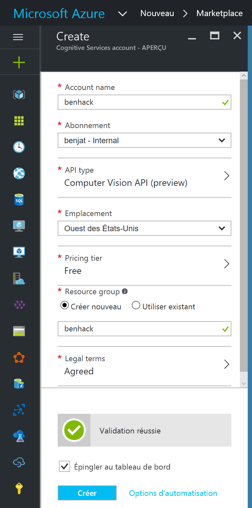
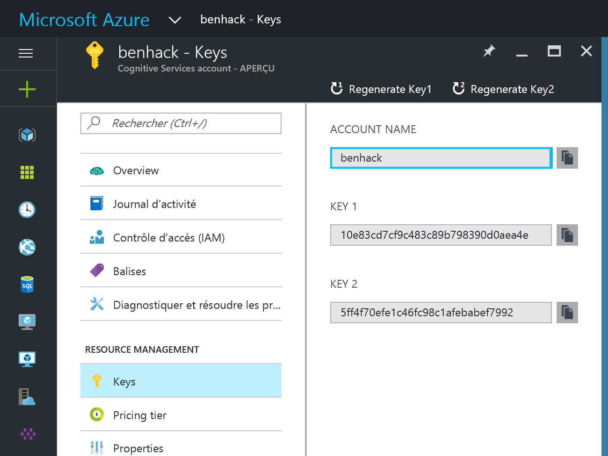

# Microsoft Cognitive Services
Pour ce mini-hack, je vous propose d'utiliser Microsoft Cognitive Services, et plus précisément l'API Computer Vision pour récupérer la légende d'une image à partir d'une URL.

## Prérequis
- Visual Studio 2015
- Un compte sur l'une des plateformes suivantes :
    - [Microsoft Azure](https://azure.microsoft.com/fr-fr/free/) - Nous utiliserons que des services gratuits
    - [Microsoft Cognitive Services](https://www.microsoft.com/cognitive-services/en-us/subscriptions) - Accès aux versions d'évaluation gratuites

## Récupération d'une clé d'API

Vous avez la possibilité de récupérer une clé d'API via votre compte Azure ou via le site Microsoft Cognitive Services, qui vous permet de générer des clés d'évaluation.

### A partir d'Azure

Sur le [portail Azure](https://portal.azure.com), créez un nouveau service Computer Vision en recherchant "Cognitive Services APIs" dans le moteur de recherche :


Complétez ensuite les différents paramètres nécessaires :
- Nom du compte : à vous de choisir
- Abonnement (dans le cas où vous auriez plusieurs abonnements Azure)
- Type d'API : Computer Vision API
- Niveau de tarification : le niveau gratuit sera suffisant
- Emplacement : Ouest des Etats-Unis (le seul choix à ce jour)
- Groupe de ressources : un nouveau groupe de ressource pour le mini-hack sera parfait
- Termes légaux : à lire et à valider
- Epingler au tableau de bord : conseillé pour accéder plus facilement à votre service



Quelques secondes plus tard, votre service sera créé et vous pourrez y accéder pour notamment récupérer une clé d'API, que vous aurez besoin dans quelques minutes.



### A partir du portail Cognitive Services

En vous rendant sur le [portail Cognitive Services](https://www.microsoft.com/cognitive-services/en-us/subscriptions), vous avez la possibilité de demander des clés d'APIs, utilisables pour de l'évaluation seulement (pas de production).
Le processus est assez simple :
- Connectez-vous avec un compte Microsoft (ex Live-Id)
- Cliquez sur "Request new trials"
- Sélectionnez les APIs qui vous intéressent (Computer Vision dans notre cas)
- Validez les conditions d'utilisation
- Cliquez sur le bouton d'abonnements

Vous aurez ensuite accès à votre clé d'API.


## Création de votre application

Maintenant que vous avez accès à une clé d'API Computer Vision, il est temps de l'utiliser. Pour éviter toute distraction, travaillons aujourd'hui avec une application Console.

Dans Visual Studio 2015, créez un nouveau projet de type Console, utilisation .NET Framework (et non .NET Core).

La première chose que doit faire l'application est de récupérer de l'utilisateur une chaîne de caractères représentant l'URL vers une photo sur internet.  
Ecrivez le code nécessaire pour cela, en vous inspirant pourquoi pas de l'exemple ci-dessous, qui utilise une boucle infinie et valide l'entrée de l'utilisateur avant de poursuivre :

```csharp
static void Main(string[] args)
{
    while (true)
    {
        Console.WriteLine("Donnez moi l'URL d'une photo à commenter");

        Uri uri = null;
        bool formatError = false;
        do
        {
            Console.Write("> ");
            String input = Console.ReadLine();
            try
            {
                uri = new Uri(input);
                formatError = false;
            }
            catch (System.UriFormatException)
            {
                Console.WriteLine("URL mal formatée, merci de réessayer");
                formatError = true;
            }

        }
        while (formatError);

        try
        {
            DisplayCaptionAsync(uri).Wait();
        }
        catch(Exception ex)
        {
            Console.WriteLine("Exception : " + ex.InnerException);
        }
    }
}

static async Task DisplayCaptionAsync(Uri uri)
{
    //TODO: Appeler l'API Computer Vision
}
```

Les APIs Cognitive Services sont des APIs REST, accessibles via des requêtes HTTP simples et donc depuis n'importe quelle plateforme et langage pouvant envoyer des requêtes HTTP.  
En .NET, nous avons la chance d'avoir à notre disposition via Nuget des SDKs prêt à l'emploi qui nous permettent de travailler avec des objets s'occupant de générer les requêtes HTTPs nécessaires.  
Ajoutez le package Nuget suivant à votre projet et remplacez les déclarations using de votre fichier Program.cs par les suivantes :

```csharp
using Microsoft.ProjectOxford.Vision;
using Microsoft.ProjectOxford.Vision.Contract;
using System;
using System.Threading.Tasks;
```

Toute la plomberie est maintenant en place pour pouvoir développer la partie la plus intéressante : l'appel au service Computer Vision et l'affichage des résultats, dans la méthode DisplayCaptionAsync dans l'exemple ci-dessus.

Les grandes étapes pour arriver à nos fins sont les suivantes :
- Créer un objet de type VisionServiceClient, en lui passant votre clé d'API récupérée dans la première étape
- Créer un tableau d'objets VisualFeature, pour indiquer à l'API quelles fonctionnalités de l'API nous souhaitons utiliser
- Appelez l'API grâce à l'objet client, à l'URL de votre photo et au tableau des fonctionnalités
- Récupérer dans l'object de résultats les éléments qui vous intéressent afin de les afficher.

Voici un exemple de code réalisant ces différentes opérations :

```csharp
var visionClient = new VisionServiceClient("<Your key>");
var features = new VisualFeature[] { VisualFeature.Tags, VisualFeature.Description };
AnalysisResult analysisResult = await visionClient.AnalyzeImageAsync(uri.ToString(), features);

foreach (var caption in analysisResult.Description.Captions)
{
    Console.WriteLine(" - " + caption.Text + " (confiance : " + caption.Confidence + ")");
}

Console.WriteLine();
```

Il ne reste plus qu'à tester votre application, qui devrait vous afficher une légende (en anglais) pour chaque URL de photo que vous lui fournirez.


Si vous n'avez pas d'inspiration, voici quelques photos que vous pouvez utiliser :
- https://upload.wikimedia.org/wikipedia/commons/thumb/f/f0/Stiftskirche_Herzogenburg_Orgel_06.JPG/800px-Stiftskirche_Herzogenburg_Orgel_06.JPG
- https://upload.wikimedia.org/wikipedia/commons/thumb/d/dc/Sigmaringen_Schloss_BW_2015-04-28_17-37-14.jpg/800px-Sigmaringen_Schloss_BW_2015-04-28_17-37-14.jpg
- https://upload.wikimedia.org/wikipedia/commons/thumb/c/cc/Parapente_-_166.jpg/800px-Parapente_-_166.jpg
- https://upload.wikimedia.org/wikipedia/commons/thumb/b/b3/Cat_on_a_macbook.JPG/1920px-Cat_on_a_macbook.JPG

Pensez à valider votre mini-hack, il y a des cadeaux à gagner !

## Pour aller plus loin

Ces parties sont optionnelles dans le cadre du mini-hack, mais voici quelques idées pour aller plus loin :

- Utiliser l'API [Microsoft Translator](https://www.microsoft.com/en-us/translator/default.aspx) pour traduire le résultat en français.
- Utiliser un modèle plus évolué qu'une application Console, comme une application Web, UWP ou pourquoi pas un Bot !